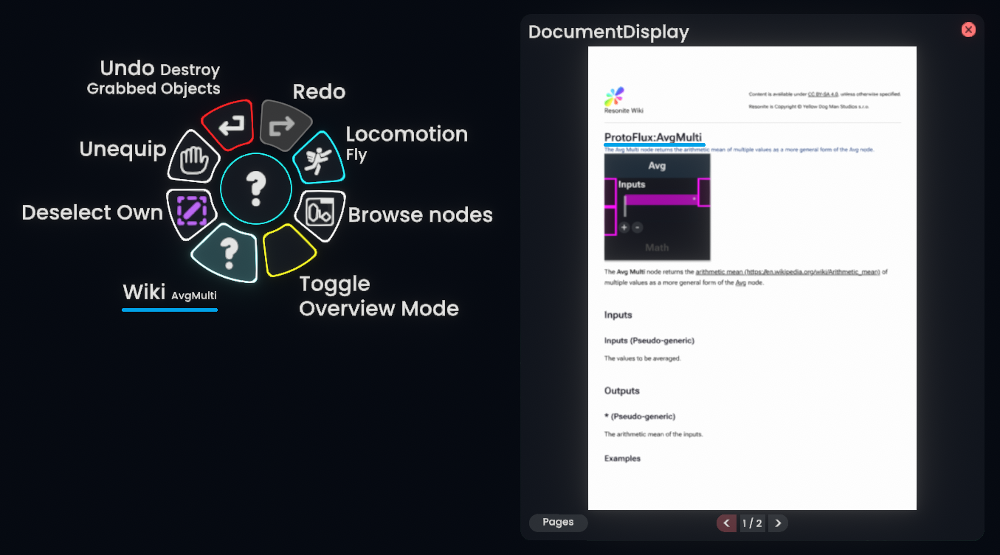

# Wiki Links Link To Pages

A [ResoniteModLoader](https://github.com/resonite-modding-group/ResoniteModLoader) mod for [Resonite](https://resonite.com/).
This mod fixes the resolution of wiki links in-game so they point to the correct wiki page. It fixes the issue of pseudo-generics that point to wiki links that don't exist. Example: Avg_Float2 -> Avg, OR_Multi_Bool -> MultiOR, Add_ColorX_Float -> Add.

This mod also has the option to change how the wiki links work. Instead of redirecting via hyper link. It can build the link into a pdf that is automatically spawned in the world.

## Installation

1. Install [ResoniteModLoader](https://github.com/resonite-modding-group/ResoniteModLoader).
2. Place [WikiLinkRedirectionWorking.dll](https://github.com/catboy1357/WikiLinksLinkToPages/releases) into your `rml_mods` folder. This folder should be at `C:\Program Files (x86)\Steam\steamapps\common\Resonite\rml_mods` for a default install. You can create it if it's missing, or if you launch the game once with ResoniteModLoader installed it will create this folder for you.
3. Start the game. If you want to verify that the mod is working you can check your Resonite logs.

## Known Issues

I could not find an easy solution for:

- ComposeBits_*
- ExtractBits_*
- ComposeTRS_*
- Compose_Scale_*
- Compose_Rotation_*

